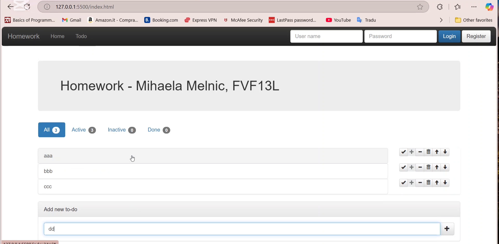
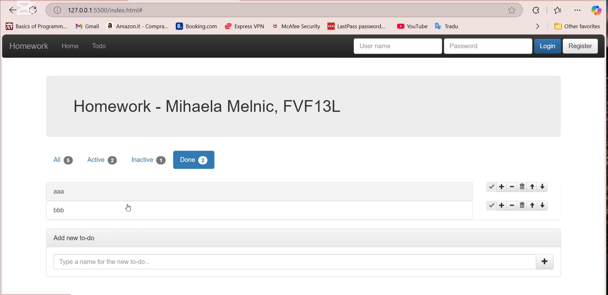
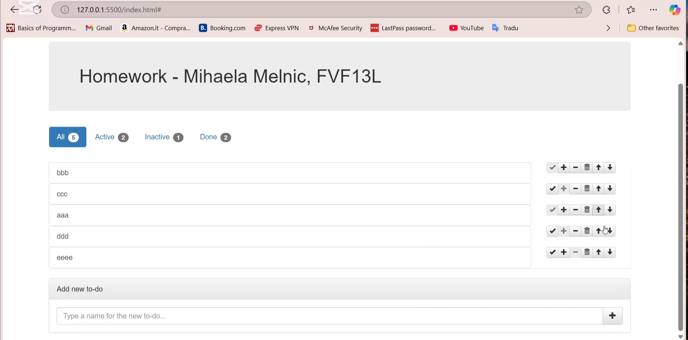
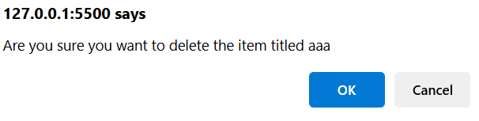
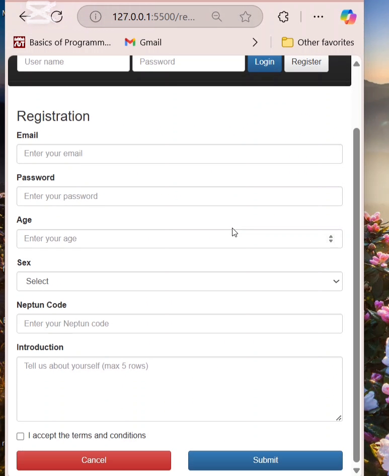
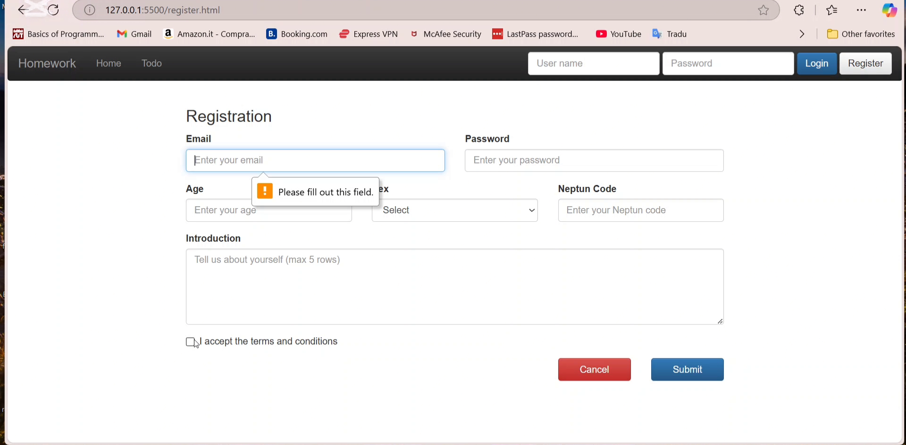

# Todo Management Application

A responsive web-based todo management application built with HTML, CSS (Bootstrap), and JavaScript. This application allows users to manage their daily tasks with various states and provides a clean, intuitive interface for task organization.

## Features

### Core Functionality
- **Add New Tasks**: Create new todo items with custom titles
- **Task State Management**: Mark tasks as Active, Inactive, or Done
- **Task Organization**: Move tasks up or down in the list
- **Task Removal**: Delete tasks with confirmation dialog
- **Persistent Storage**: Tasks are saved to localStorage and persist across browser sessions

### Navigation & Filtering
- **Tab-based Filtering**: View tasks by state (All, Active, Inactive, Done)
- **Badge Counters**: Real-time count of tasks in each category
- **Responsive Design**: Works seamlessly across desktop and mobile devices

### User Interface
- **Bootstrap Integration**: Clean, professional styling with Bootstrap 3
- **Navigation Bar**: Consistent navigation across all pages
- **Glyphicon Icons**: Intuitive action buttons with clear visual indicators
- **Responsive Layout**: Mobile-friendly design that adapts to different screen sizes

## Project Structure

```
todo1/
├── index.html      # Main todo application page
├── home.html       # Landing/home page
├── register.html   # User registration form
├── todo.js         # Core JavaScript functionality
└── README.md       # Project documentation
```

## Getting Started

### Prerequisites
- A modern web browser (Chrome, Firefox, Safari, Edge)
- No additional installations required

### Running the Application
1. Clone or download the project files
2. Open `home.html` in your web browser to start
3. Navigate to the Todo page using the navigation menu
4. Start adding and managing your tasks!

## User Guide

### Adding Tasks
1. Navigate to the Todo page (`index.html`)
2. Use the input field at the bottom of the page
3. Type your task name and click the "+" button or press Enter
4. New tasks are automatically set to "Active" state

    

### Managing Tasks
Each task has six action buttons:
- **✓ (Check)**: Mark task as Done
- **+ (Plus)**: Mark task as Active
- **- (Minus)**: Mark task as Inactive
- **🗑️ (Trash)**: Remove task (with confirmation)
- **↑ (Arrow Up)**: Move task up in the list
- **↓ (Arrow Down)**: Move task down in the list

Example results:
- Tasks "aaa"and "bbb" set as done, task "eeee" set as inactive:
  
    

- Priority of tasks "bbb" and "ccc" increased across all lists:

    

- Confirmation message before deletion:

    

### Filtering Tasks
Use the tab navigation to filter tasks:
- **All**: Show all tasks regardless of state
- **Active**: Show only active tasks
- **Inactive**: Show only inactive tasks
- **Done**: Show only completed tasks

The badge next to each tab shows the count of tasks in that category.

## Registration Page

The application includes a comprehensive registration form with the following fields:
- Email address (required)
- Password (required)
- Age (18-99, required)
- Gender selection (required)
- Neptun code (6-character alphanumeric, required)
- Introduction text area (optional, max 500 characters)
- Terms and conditions acceptance (required)

Form includes client-side validation and responsive design.





## Technical Details

### Technologies Used
- **HTML5**: Semantic markup and form validation
- **CSS3**: Styling via Bootstrap 3.3.7 framework
- **JavaScript (ES5)**: Core functionality and DOM manipulation
- **localStorage**: Client-side data persistence

### Browser Compatibility
- Chrome (latest)
- Firefox (latest)
- Safari (latest)
- Edge (latest)
- Internet Explorer 11+

### Data Persistence
Tasks are automatically saved to the browser's localStorage, ensuring your todo list persists between sessions. No server or database required.

## Code Structure

### JavaScript Architecture
- **Todo Constructor**: Creates todo objects with name and state
- **State Management**: Handles task state transitions (active, inactive, done)
- **DOM Manipulation**: Dynamic rendering of task list and UI updates
- **Event Handling**: Form submission, button clicks, and tab selection
- **Local Storage**: Automatic saving and loading of task data

### Key Functions
- `renderTodos()`: Updates the visual task list
- `saveTodos()`: Persists tasks to localStorage
- `selectTab()`: Handles tab filtering
- `updateBadges()`: Updates task count indicators

## Future Enhancements

Potential improvements for future versions:
- User authentication and multi-user support
- Task due dates and reminders
- Task categories and tags
- Export/import functionality
- Dark mode theme
- Drag-and-drop task reordering
- Task search and filtering
- Backend integration for cloud sync

---